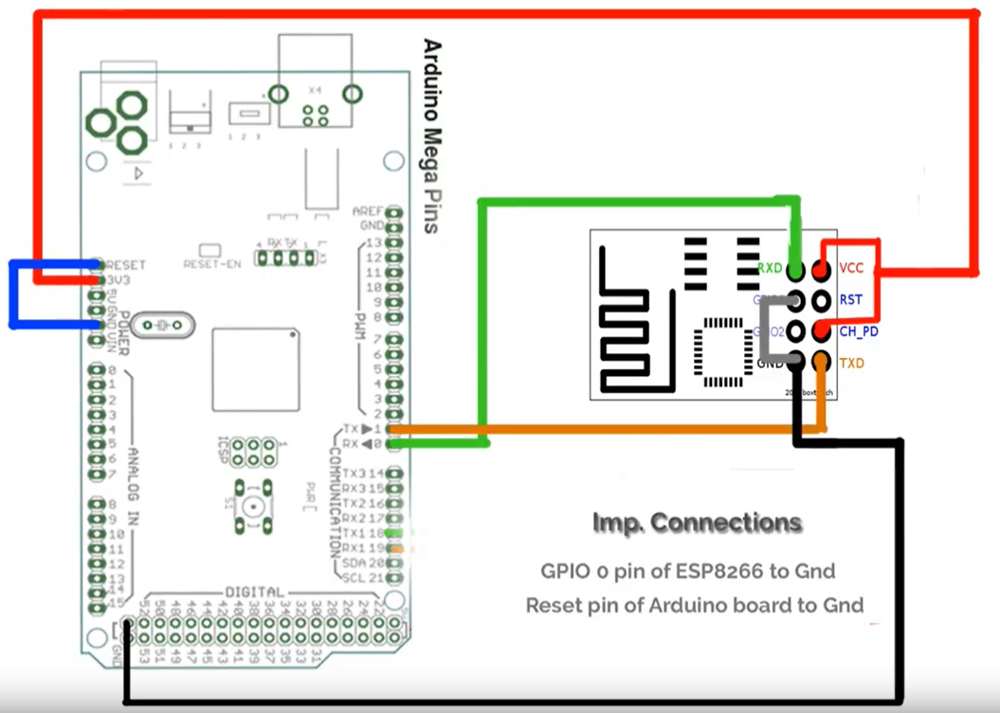
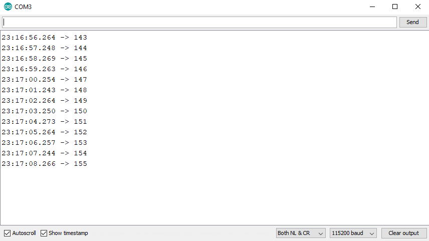

# Prototipo com arduino mega

## Indice

  * [00 Keypad input](#00-keypad-input)
  * [01 RFID validation](#01-rfid-validation)
  * [02 OLED display](#02-oled-display)
  * [03 Flash ESP01 with Arduino MEGA](#03-flash-esp01-with-arduino-mega)


## 00 Keypad input
[Voltar para índice](#indice)

  Objetivo: configurar VS Code para usar com arduino e adaptar codigo para ler input de keypad.

  * Configura VS Code para usar com arduino;
    * ref: https://cuneyt.aliustaoglu.biz/en/enabling-arduino-intellisense-with-visual-studio-code/

    * (VS Code) Abre 'settings.json' e adiciona os atributos:

    ```javascript
    {
      "arduino.path": "C:\\Program Files (x86)\\Arduino",
      "arduino.additionalUrls": [
        "http://arduino.esp8266.com/stable/package_esp8266com_index.json"
      ],
      "arduino.logLevel":"info",
      "arduino.enableUSBDetection": true,
      "C_Cpp.intelliSenseEngine": "Tag Parser"
    }

    ```

    * (VS Code) Abre C/C++: Edit Configurations (JSON) e atualiza para:

    ```javascript
    {
      "configurations": [
          {
              "name": "Win32",
              "includePath": [
                  "C:\\Users\\Avell\\AppData\\Local\\Arduino15\\packages\\esp8266\\tools\\**",
                  "C:\\Users\\Avell\\AppData\\Local\\Arduino15\\packages\\esp8266\\hardware\\esp8266\\2.6.3\\**",
                  "C:\\Program Files (x86)\\Arduino\\tools\\**",
                  "C:\\Program Files (x86)\\Arduino\\hardware\\arduino\\avr\\**",
                  "${workspaceFolder}/**",
                  "C:\\Users\\Avell\\Documents\\Arduino\\libraries\\Keypad\\src"
              ],
              "browse": {
                  "limitSymbolsToIncludedHeaders": false,
                  "path": [
                      "C:\\Program Files (x86)\\Arduino\\hardware\tools\\avr\\avr\\include",
                      "C:\\Users\\Avell\\Documents\\Arduino\\libraries\\Keypad\\src",
                      "${workspaceRoot}"
                  ]
              },
              "defines": [
                  "_DEBUG",
                  "UNICODE",
                  "_UNICODE"
              ],
              "compilerPath": "/usr/bin/gcc",
              "cStandard": "c11",
              "cppStandard": "c++17",
              "intelliSenseMode": "msvc-x64",
              "forcedInclude": [
                  "C:\\Program Files (x86)\\Arduino\\hardware\\arduino\\avr\\cores\\arduino\\Arduino.h"
              ]
          }
      ],
      "version": 4
    }

    ```

  * Adiciona codigo para ler entradas do keypad
    * Ref: https://playground.arduino.cc/Main/KeypadTutorial/
  * Cria esquema de ligacao simplificado usando Fritzing Software;
  * Salva imagem do esquema de ligacao com nome 'schematics' na pasta 'firmware/doc';

## 01 RFID validation
[Voltar para índice](#indice)

  Objetivo: substituir push button por leitor RFID para validacao do usuario.

  * Libera pinos 50, 51, 53 (pinos padrao para leitor RFID):
    * Readapta pinos e cria novo schematics;
  
  * Testa codigo simples conforme tutorial:
    * https://www.instructables.com/id/Interfacing-RFID-RC522-With-Arduino-MEGA-a-Simple-/

    ```c++
    /*
    PINOUT:
    RC522 MODULE    Uno/Nano     MEGA
    SDA             D10          D9
    SCK             D13          D52
    MOSI            D11          D51
    MISO            D12          D50
    IRQ             N/A          N/A
    GND             GND          GND
    RST             D9           D8
    3.3V            3.3V         3.3V
    */
    /* Include the standard Arduino SPI library */
    #include <SPI.h>
    /* Include the RFID library */
    #include <RFID.h>

    /* Define the DIO used for the SDA (SS) and RST (reset) pins. */
    #define SDA_DIO 9
    #define RESET_DIO 8
    /* Create an instance of the RFID library */
    RFID RC522(SDA_DIO, RESET_DIO); 

    void setup()
    { 
      Serial.begin(9600);
      /* Enable the SPI interface */
      SPI.begin(); 
      /* Initialise the RFID reader */
      RC522.init();
    }

    void loop()
    {
      /* Has a card been detected? */
      if (RC522.isCard())
      {
        /* If so then get its serial number */
        RC522.readCardSerial();
        Serial.println("Card detected:");
        for(int i=0;i<5;i++)
        {
        Serial.print(RC522.serNum[i],DEC);
        //Serial.print(RC522.serNum[i],HEX); //to print card detail in Hexa Decimal format
        }
        Serial.println();
        Serial.println();
      }
      delay(200);
    }

    ```

  * Adapta partes do codigo acima ao main.ino e testa funcionalidades separadamente sem excluir funcionalidade do botao;

  * Substitui funcionalidade do push button por isCard do RFID.
    * Se cartao lido -> buttonState = HIGH

## 02 OLED display
[Voltar para índice](#indice)

  Objetivo: conectar OLED display ao circuito e transmitir mensagens por ele ao inves de usar o serial monitor;

  * Conecta display ao arduino mega:
    * Ref: https://www.youtube.com/watch?v=fZ3YhvOWwEk

  * Instala bibliotecas da adafruit:
    * Sketch > include library > manage libraries > ...search and install:
      * <Adafruit_GFX.h>
      * <Adafruit_SSD1306.h>

  * Faz upload de codigo de teste oficial da adafruit:
    * Files > Examples > Adafruit SSD1306 > ssd1306_128x64_i2c

  * Faz upload de codigo mais simples com menos parametros:
    * Ref: https://www.youtube.com/watch?v=BzL0xRrvPPI

  * Adapta firmware atual adicionando features do codigo mais simples encontrado:

    ```c++
    /*

      hiPeer

      Turn specificied LEDs ON and OFF

      Created 13 Jan 2020 by Calil Amaral
      Updated 15 Jan 2020 by Calil Amaral
      Updated 18 Jan 2020 by Calil Amaral - Added keypad feature
      Updated 20 Jan 2020 by Calil Amaral - Added RFID reader
      Updated 26 Jan 2020 by Calil Amaral - Added OLED display

    */

    // LEDs and button -------------------------------------------------------------

    // User info
    const int ledButton = 46; // user validation pin (when pressed, change userStatus to 1)
    int ledButtonState = LOW; // store initial state of 'ledButton' to LOW
    int userState = 0;        // store user status (1 - valid, 0 - invalid)
    String inputString = "";  // string to hold user input
    int inputInteger = 0;     // integer to hold converted user input

    // Container info
    const int clusterSize = 12;
    int containerPins[clusterSize] = {22, 24, 26, 28, 30, 32, 34, 36, 38, 40, 42, 44}; // define array with container pins
    int containerSignalPin = 28;                                              // define pino que envia sinal para LEDs (default = 28);
    int containerState = 0;                                                   // define estado do container;
    int containerPin;                                                         // define variable to hold container pin number

    // KEYPAD ---------------------------------------------------------------------

    // Libraries to use with keypad
    #include <Keypad.h> 

    // Define number of rows and columns (keypad)
    const byte ROWS = 4; // Four rows
    const byte COLS = 3; // Three columns

    // Define the Keymap (keypad)
    char keys[ROWS][COLS] = {
      {'1','2','3'},
      {'4','5','6'},
      {'7','8','9'},
      {'*','0','#'}
    };

    // Connect keypad ROW0, ROW1, ROW2 and ROW3 to these Arduino pins.
    byte rowPins[ROWS] = { 37, 39, 41, 43};
    // Connect keypad COL0, COL1 and COL2 to these Arduino pins.
    byte colPins[COLS] = { 31, 33, 35 };

    // Create the Keypad
    Keypad kpd = Keypad( makeKeymap(keys), rowPins, colPins, ROWS, COLS );

    // RFID RC522 ------------------------------------------------------------------

    // Libraries
    #include <SPI.h>
    #include <RFID.h>

    // Define the DIO used for the SDA (SS) and RST (reset) pins
    #define SDA_DIO 9
    #define RESET_DIO 8

    // Create an instance of the RFID library
    RFID RC522(SDA_DIO, RESET_DIO); 

    // OLED Display ----------------------------------------------------------------

    // Libraries
    #include <Adafruit_GFX.h>
    #include <Adafruit_SSD1306.h>

    // Definitions
    #define OLED_RESET 4
    Adafruit_SSD1306 display( OLED_RESET);


    // SETUP -----------------------------------------------------------------------

    // the setup function runs once when you press reset or power the board
    void setup() {

      // start serial communications at 9600 bits per second
      Serial.begin(9600);

      // OLED display --------------------------------------------------------------

      // Begin display communication 
      display.begin(SSD1306_SWITCHCAPVCC, 0x3C);
      
      // RFID ----------------------------------------------------------------------

      // Enable the SPI interface (use with RFID)
      SPI.begin(); 

      // Initialise the RFID reader (use with RFID)
      RC522.init();

      // LEDs and button -----------------------------------------------------------

      // start digital pin 'ledButton' as input
      pinMode(ledButton, INPUT);

      // start 'LED_BUILTIN' as output
      pinMode(LED_BUILTIN, OUTPUT);

      // initiate 'containerPins' as output and blink each container once for visual confirmation
      for (int i = 0; i <= clusterSize - 1; i++) {

        // initiate containerPin as output
        pinMode(containerPins[i], OUTPUT);

        // blink 'LED_BUILTIN' and container
        digitalWrite(LED_BUILTIN, HIGH);
        digitalWrite(containerPins[i], HIGH);
        delay(200);
        digitalWrite(LED_BUILTIN, LOW);
        digitalWrite(containerPins[i], LOW);

      }

      // message user to validate session
      Serial.println("Pass your card to validate new session");

    }

    // the loop function runs over and over again forever
    void loop() {

      // OLED Display -------------------------------------------

      display.display();
      display.clearDisplay();
      display.setTextColor(WHITE);
      display.setTextSize(1);
      display.setCursor(0,20);
      display.print("Hello World!");

      // Is user still active?

      if (userState != 1){
        // Has a card been detected?
        if (RC522.isCard())
        {    
          // If so then get its serial number
          RC522.readCardSerial();
      
          // Print card detected
          Serial.println("Card detected:");
      
          // Print serial number
          for(int i=0;i<5;i++)
          {
          Serial.print(RC522.serNum[i],DEC);
          //Serial.print(RC522.serNum[i],HEX); //to print card detail in Hexa Decimal format
          }
          Serial.println();
          Serial.println();

          // Activate dummy button
          ledButtonState = HIGH;
          delay(100);
        }
      }
      

      // read ledButton and store result in 'ledButtonState'
      // ledButtonState = digitalRead(ledButton);

      // if ledButton active
      if (ledButtonState == HIGH){

        // deactivate dummy button
        ledButtonState = LOW;

        // switch userState to 1 (valid)
        userState = 1;
        Serial.print("User state: ");
        Serial.println(userState);
        Serial.println("Valid user");
        Serial.println();
        Serial.println("Type the number of the container you wish to open :");
        delay(200);
      }

      // Read keypad

      int inputChar = kpd.getKey();

      // check if input is number and add to string
      if (isDigit(inputChar)) {
        // convert the incoming byte to a char and add it to the string:
        inputString += (char)inputChar;
      }

      // if you get a '#', print the string, then the string's value:
      if (inputChar == '#') {

          // if user is valid
          if(userState == 1){

            // convert input to integer
            inputInteger = inputString.toInt();

            // if number is out of range
            if ((inputInteger < 1) || (inputInteger > 12)){

              // print selected number
              Serial.print("Selected container:");
              Serial.println(inputInteger);

              // print error message
              Serial.println("Error: Number of container must be an integer between 1 and 12");
              Serial.println("Type the number of the container you wish to open :");
              inputString = "";

            // else, if number is within the range
            } else {

              Serial.print("Selected container:");
              Serial.println(inputInteger);

              // define 'containerPin' according to user input
              containerPin = containerPins[inputInteger - 1];
              Serial.print("Container pin number:");
              Serial.println(containerPin);

              // open container
              containerState = 1; ////////////// VALIDATE USER AND CONTAINER HERE!

              // reset input string
              inputString = "";

            }

          // else, if user is not valid
          } else {

            // message user to validate session
            Serial.println("Pass your card to validate session before selecting the container");

            // reset input string
            inputString = "";

          };

        };

        // if user is valid and 'containerState' is active
        if ((userState ==1)&&(containerState == 1)){

          // activate container
          digitalWrite(containerPin, HIGH);  //////////////////// OPEN CONTAINER HERE!

          // message user about countdown time
          Serial.println("The selected container will be opened for 3 seconds. Hurry up!");
          delay(3000);

          // deactivate container
          digitalWrite(containerPin, LOW);

          // reset 'containerState' and 'userState'
          containerState = 0;
          userState = 0;

          // message user to validate session
          Serial.println();
          Serial.println();
          Serial.println("Pass card to validate new session");
        }
      }
    ```

  * Substitui mensagens ao usuario via monitor serial por mensagens via OLED display:

    ```c++
    /*

      hiPeer

      Turn specificied LEDs ON and OFF

      Created 13 Jan 2020 by Calil Amaral
      Updated 15 Jan 2020 by Calil Amaral
      Updated 18 Jan 2020 by Calil Amaral - Added keypad feature
      Updated 20 Jan 2020 by Calil Amaral - Added RFID reader
      Updated 26 Jan 2020 by Calil Amaral - Added OLED display

    */

    // LEDs and button -------------------------------------------------------------

    // User info
    const int ledButton = 46; // user validation pin (when pressed, change userStatus to 1)
    int ledButtonState = LOW; // store initial state of 'ledButton' to LOW
    int userState = 0;        // store user status (1 - valid, 0 - invalid)
    String inputString = "";  // string to hold user input
    int inputInteger = 0;     // integer to hold converted user input

    // Container info
    const int clusterSize = 12;
    int containerPins[clusterSize] = {22, 24, 26, 28, 30, 32, 34, 36, 38, 40, 42, 44}; // define array with container pins
    int containerSignalPin = 28;                                              // define pino que envia sinal para LEDs (default = 28);
    int containerState = 0;                                                   // define estado do container;
    int containerPin;                                                         // define variable to hold container pin number

    // KEYPAD ---------------------------------------------------------------------

    // Libraries to use with keypad
    #include <Keypad.h> 

    // Define number of rows and columns (keypad)
    const byte ROWS = 4; // Four rows
    const byte COLS = 3; // Three columns

    // Define the Keymap (keypad)
    char keys[ROWS][COLS] = {
      {'1','2','3'},
      {'4','5','6'},
      {'7','8','9'},
      {'*','0','#'}
    };

    // Connect keypad ROW0, ROW1, ROW2 and ROW3 to these Arduino pins.
    byte rowPins[ROWS] = { 37, 39, 41, 43};
    // Connect keypad COL0, COL1 and COL2 to these Arduino pins.
    byte colPins[COLS] = { 31, 33, 35 };

    // Create the Keypad
    Keypad kpd = Keypad( makeKeymap(keys), rowPins, colPins, ROWS, COLS );

    // RFID RC522 ------------------------------------------------------------------

    // Libraries
    #include <SPI.h>
    #include <RFID.h>

    // Define the DIO used for the SDA (SS) and RST (reset) pins
    #define SDA_DIO 9
    #define RESET_DIO 8

    // Create an instance of the RFID library
    RFID RC522(SDA_DIO, RESET_DIO); 

    // OLED Display ----------------------------------------------------------------

    // Libraries
    #include <Adafruit_GFX.h>
    #include <Adafruit_SSD1306.h>

    // Definitions
    #define OLED_RESET 4
    Adafruit_SSD1306 display( OLED_RESET);

    // SETUP -----------------------------------------------------------------------

    // the setup function runs once when you press reset or power the board
    void setup() {

      // start serial communications at 9600 bits per second
      Serial.begin(9600);

      // OLED display --------------------------------------------------------------

      // Begin display communication 
      display.begin(SSD1306_SWITCHCAPVCC, 0x3C);
      
      // RFID ----------------------------------------------------------------------

      // Enable the SPI interface (use with RFID)
      SPI.begin(); 

      // Initialise the RFID reader (use with RFID)
      RC522.init();

      // LEDs and button -----------------------------------------------------------

      // start digital pin 'ledButton' as input
      pinMode(ledButton, INPUT);

      // start 'LED_BUILTIN' as output
      pinMode(LED_BUILTIN, OUTPUT);

      // initiate 'containerPins' as output and blink each container once for visual confirmation
      for (int i = 0; i <= clusterSize - 1; i++) {

        // initiate containerPin as output
        pinMode(containerPins[i], OUTPUT);

        // blink 'LED_BUILTIN' and container
        digitalWrite(LED_BUILTIN, HIGH);
        digitalWrite(containerPins[i], HIGH);
        delay(200);
        digitalWrite(LED_BUILTIN, LOW);
        digitalWrite(containerPins[i], LOW);

      }

      // message user to validate session
      display.clearDisplay();
      display.setTextColor(WHITE);
      display.setTextSize(1);
      display.setCursor(0,0);
      display.print("Pass your card to validate new session");
      display.display();
      // Serial.println("Pass your card to validate new session");

    }

    // the loop function runs over and over again forever
    void loop() {

      // OLED Display -------------------------------------------

      

      // Is user still active?
      if (userState != 1){
        // Has a card been detected?
        if (RC522.isCard())
        {    
          // If so then get its serial number
          RC522.readCardSerial();
      
          // Print card detected      
          display.clearDisplay();
          display.setTextColor(WHITE);
          display.setTextSize(1);
          display.setCursor(0,0);
          display.print("Card detected!");      
          display.display();
          delay(1000);
          //Serial.println("Card detected:");
      
          // Print serial number
          for(int i=0;i<5;i++)
          {
          Serial.print(RC522.serNum[i],DEC);
          //Serial.print(RC522.serNum[i],HEX); //to print card detail in Hexa Decimal format
          }
          Serial.println();
          Serial.println();

          // Activate dummy button
          ledButtonState = HIGH;
          delay(100);
        }
      }
      

      // read ledButton and store result in 'ledButtonState'
      // ledButtonState = digitalRead(ledButton);

      // if ledButton active
      if (ledButtonState == HIGH){

        // deactivate dummy button
        ledButtonState = LOW;

        // switch userState to 1 (valid)
        userState = 1;
        Serial.print("User state: ");
        Serial.println(userState);
        Serial.println("Valid user");
        Serial.println();

        // Ask for the number of the container
        display.clearDisplay();
        display.setTextColor(WHITE);
        display.setTextSize(1);
        display.setCursor(0,0);
        display.print("Type the number of the container you wish to open and press # to open it: ");
        display.display();
        // Serial.println("Type the number of the container you wish to open :");
        delay(200);
      }

      // Read keypad

      int inputChar = kpd.getKey();

      // check if input is number and add to string
      if (isDigit(inputChar)) {
        // convert the incoming byte to a char and add it to the string:
        inputString += (char)inputChar;

        // Print number entered
        display.clearDisplay();
        display.setTextColor(WHITE);
        display.setTextSize(1);
        display.setCursor(0,0);
        display.print("Type the number of the container you wish to open and press # to open it: "+ inputString);
        display.display();
        
      }

      // if you get a '#', print the string, then the string's value:
      if (inputChar == '#') {

          // print selected number
          display.clearDisplay();
          display.setTextColor(WHITE);
          display.setTextSize(1);
          display.setCursor(0,0);
          display.print("Selected container: "+ inputString);
          display.display();
          delay(1000);

          // if user is valid
          if(userState == 1){

            // convert input to integer
            inputInteger = inputString.toInt();

            // if number is out of range
            if ((inputInteger < 1) || (inputInteger > 12)){

              // clean inputString
              inputString = "";

              // print error message
              display.clearDisplay();
              display.setTextColor(WHITE);
              display.setTextSize(1);
              display.setCursor(0,0);
              display.print("Error: Number of container must be an integer between 1 and 12");
              display.display();
              delay(2500);          
              //Serial.println("Error: Number of container must be an integer between 1 and 12");

              // ask for new entry
              display.clearDisplay();
              display.setTextColor(WHITE);
              display.setTextSize(1);
              display.setCursor(0,0);
              display.print("Type the number of the container you wish to open and press # to open it: "+ inputString);
              display.display();
              //Serial.println("Type the number of the container you wish to open :");
              

            // else, if number is within the range
            } else {

              // define 'containerPin' according to user input
              containerPin = containerPins[inputInteger - 1];
              Serial.print("Container pin number:");
              Serial.println(containerPin);

              // open container
              containerState = 1; ////////////// VALIDATE USER AND CONTAINER HERE!

              // reset input string
              inputString = "";

            }

          // else, if user is not valid
          } else {

            // message user to validate session
            display.clearDisplay();
            display.setTextColor(WHITE);
            display.setTextSize(1);
            display.setCursor(0,0);
            display.print("Pass your card to validate session before selecting the container");
            display.display();
            delay(1000);
            //Serial.println("Pass your card to validate session before selecting the container");

            // reset input string
            inputString = "";

          };

        };

        // if user is valid and 'containerState' is active
        if ((userState ==1)&&(containerState == 1)){      

          // message user about countdown time
          display.clearDisplay();
          display.setTextColor(WHITE);
          display.setTextSize(1);
          display.setCursor(0,0);
          display.print("The selected container will be opened for 3 seconds. Hurry up!");
          display.display();
          delay(2500);

          // inform user that container is being opened
          display.clearDisplay();
          display.setTextColor(WHITE);
          display.setTextSize(1);
          display.setCursor(0,0);
          display.print("Opening container...");
          display.display();
          delay(200);

          // activate container
          digitalWrite(containerPin, HIGH);  //////////////////// OPEN CONTAINER HERE!
          delay(3000);

          // deactivate container
          digitalWrite(containerPin, LOW);

          // reset 'containerState' and 'userState'
          containerState = 0;
          userState = 0;

          // message user to validate session
          display.clearDisplay();
          display.setTextColor(WHITE);
          display.setTextSize(1);
          display.setCursor(0,0);
          display.print("Pass your card to validate new session");
          display.display();
          //Serial.println();
          //Serial.println();
          //Serial.println("Pass card to validate new session");
        }
      }
    ```

## 03 Flash ESP01 with Arduino MEGA
[Voltar para índice](#indice)

  Objetivo: gravar firmware do ESP01 usando Arduino MEGA para usa-lo como modulo WiFi. Obs.: isso so foi necessario por nao termos gravador disponivel no momento.

  _Arduino IDE setup:_

  * Open arduino IDE;
  * Follow the steps in [this video](https://www.youtube.com/watch?v=rtsWLI4vTJk) to setup libraries and environment for esp8266;
  * Select tools > board > generic ESP8266 board;    
  * Write your code using Arduino IDE;
    * Make sure to use Serial.println() to write test message to verify later if code is working;
    * Use example code below (test-code-print-x.ino)

    ```c++
    // test-code-print-x

    int x = 0;

    void setup() {
      // put your setup code here, to run once:
      Serial.begin(115200);
      delay(100);
      Serial.println("Setup done");
    }

    void loop() {
      // put your main code here, to run repeatedly:
      Serial.println(x);
      delay(1000);
      x++; 

    }
    ```

  * Export firmware to binare file within arduino IDE (sketch > export compiled binary);
  * Close arduino IDE;

  _Wiring_
  
  * Wire ESP01 to arduino MEGA (make sure to connect 'Reset' pin to 'GND' pin in arduino);    

    
    Source: [Most easiest & simple way to program ESP8266 01 Module via Arduino Firmware | ESP8266 projects](https://www.youtube.com/watch?v=rtsWLI4vTJk)

    * When GPIO0 is connected to ground, ESP01 is set to programmable mode;
    * When 'Reset' and 'GND' are connected in arduino, it is set to passive mode;
  
  _ESP8266 flasher:_

  * Download esp8266_flasher;
  * Connect arduino to USB port;
  * Open esp8266_flasher.exe;
  * Select port (check port in windows device manager);
  * Select the binary file to flash;
  * Click 'download';
    * If it fails to connect, try disconnecting and reconnecting USB port;
  * Wait until 100% of the bin file is flashed;
  * Ignore message 'Failed to leave Flash mode';
  * Close esp8266_flasher.exe;
  * Disconnect arduino from USB port;
  * Disconnect 'GPIO0' from 'GND';
  * Disconnect 'Reset' pin from 'GND' in Arduino;
  * Reconnect arduino to USB port;

  _Check if code is working:_

  * Open arduino, and select tools > board > generic ESP8266 board;
  * Select appropriate port (check port in windows device manager);
  * Open arduino ide > serial monitor;  
  * Setup serial monitor according to baud rate defined in your code;

        

  * Check if message is shown in serial monitor;
    * Case nothing happens, try reconnecting arduino to USB port;

## Instala ESP32 no IDE do arduino

  Objetivo: preparar IDE do arduino para gravar firmware na ESP32.

  Card: https://trello.com/c/gEHdWkfE

  * (Arduino IDE) Adiciona link no campo de URL em File > Preferences > Additional Boards manager URLs: `https://dl.espressif.com/dl/package_esp32_index.json, http://arduino.esp8266.com/stable/package_esp8266com_index.json`

  Obs: Os endereços devem ser separados por vírgula e apontam para links que disponibilizam arquivos de instalação dos esp32 e esp8266. 

  * (Arduino IDE) Instala placas em tools > board > boards manager:
    * Busca por `esp8266` e instala `esp8266 by ESP8266 Community` ;
    * Busca por `esp32` e instala `esp32 by Espressif Systems` ;
  
  * Cria código 'blink' de teste para gravar nas placas disponíveis:

    ```cpp
    void setup(){
      pinMode(2, OUTPUT);
    }

    void loop(){
        digitalWrite(2,HIGH);
        delay(1000);
        digitalWrite(2,LOW);
        delay(1000);
    }
    ```
    
    Obs: de maneira opcional, o código pode ser gerado em blocos no site http://easycoding.tn/;
      * Para ESP32: http://easycoding.tn/esp32/demos/code/
      * Para ESP8266: http://easycoding.tn/tuniot/demos/code/

  * Seleciona placa em 'tools' > 'board':
    * Se ESP32: > 'ESP32 Dev Module' ;
    * Se ESP8266: 'Generic ESP8266 Module';

  * Seleciona porta em 'tools' > 'Port' ;

  * Pressiona 'upload' (seta) para gravar código na placa selecionada;
    * ESP32: 
      * Pressione botão 'boot' enquanto faz upload para ajustar placa para modo de gravação;
    * ESP8266: 
      * Pressione botão 'flash' enquanto faz upload para ajustar placa para modo de gravação;

  * Referências:
    * Instala ESP32 ao arduino: https://www.youtube.com/watch?v=mBaS3YnqDaU
    * Blink internal LED: https://www.youtube.com/watch?v=lIxs7WG1j-U